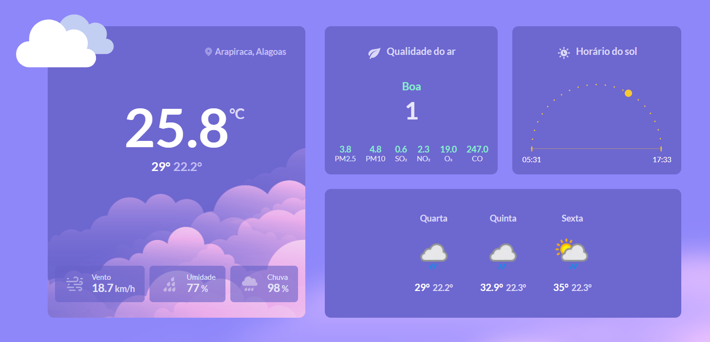

# Weather App

Welcolme to the Weather App! This is a simple weather app based on user location built with HTML, CSS and Javascript. The main objective of this project is to apply and improve knowledge in pure technologies.

## Deploy

The project is deployed on Vercel. You can access by clicking the button below:

## Credits

This project was based on the challenge proposed by [Rocketseat](https://www.github.com/rocketseat) through its [#boraCodar](https://boracodar.dev/) event.

## Final Considerations

It was extremely important to develop this project, considering that it was essential to apply and improve current knowledge in the pure technologies.

If you want to contribute to this project, feel free to submit a pull request with your suggestions!
